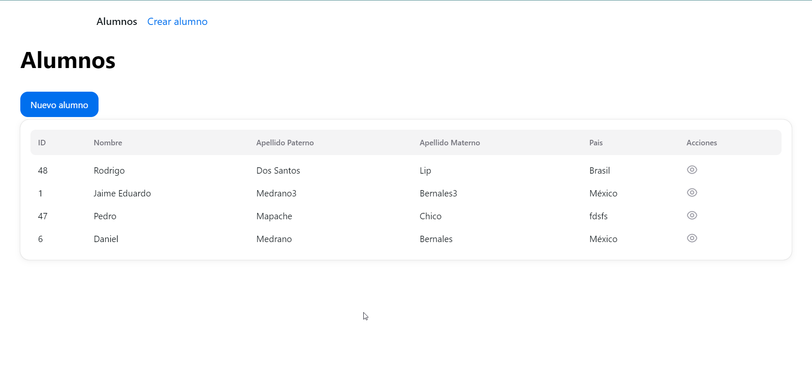
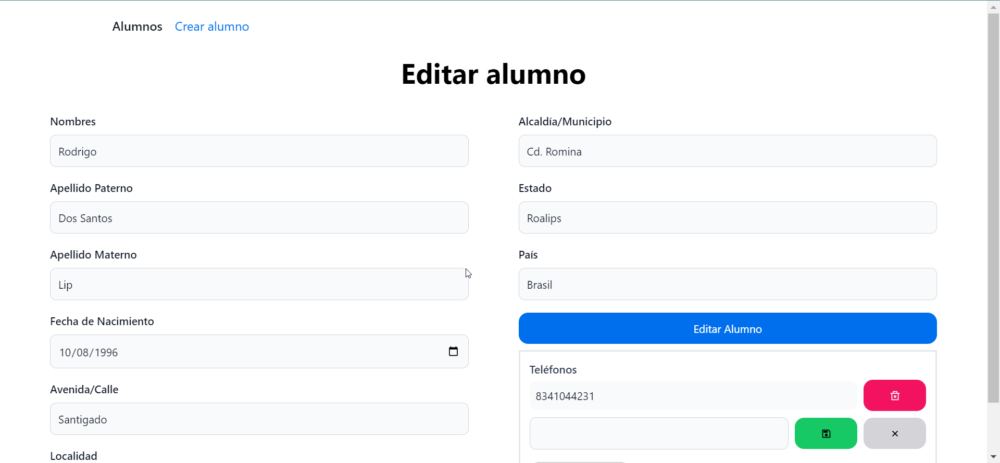

# Proyecto de Gestión de Alumnos

Este proyecto es una aplicación web para gestionar información de alumnos utilizando Vite, React, TypeScript

Blibliotecas utilizadas:
*axios
*react-hook-form
*react-hot-toast
*react-icons
*react-router-dom
*zod
\*Nextui

## Instalación

1. **Clona el repositorio:**

   ```bash
   -yarn
   -yarn dev
   ```

2. **Inicia el servidor backend:**
   https://github.com/jmedrano97/prueba_python_alumnos

## Vista previa



